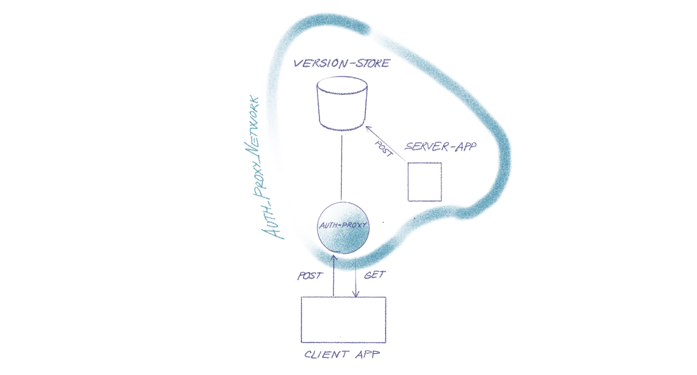

version-store
========


хранение версий документов RG.RU в Elasticsearch

-------------------------------

## Залача

Когда редактируется какой-нибудь документ, текст время от времени 
автоматически сохраняется в базу данных. Однако, если редактор по ошибке что-то изменил в тексте,
и эти изменения успели сохраниться, то возможности вернуться к предыдущей версии нет.

Сервис хранения версий документов и возврата к любой из них, наподобие того 
как это реализовано в Google Docs, был бы полезным. 
Пользовательский-интерфейс может выглядеть, как показано на рисунке.


## Схема приложения

В качестве хранилища версий был выбран Elasticsearch.


API сервиса должен включать возможности 1) показа списка сохранённых версий, 2) извлечения отдельной версии документа, и 3) сохранения новой версии.




## Безопасность

**API** сервиса доступен только пользователям авторизованным в **auth-proxy**.

Далее по тексту ссылки и примеры кода являются рабочими. Чтобы они срабатывали вам необходимо  авторизоваться в
<a href="https://auth-admin.now.sh/?url=https://auth-proxy.rg.ru">Auth-Proxy</a>.


## Структура документа

Сохраняемый документ может иметь любую структуру и должен быть представлен в JSON формате.
Версия документа однозначно определяется значением следующих полей 

- **type** : string - тип документа
- **id** : int64 - идентификатор документа
- **version_time** : timestamp - штамп времени создания версии. 
  Может быть в строковом формате, например `"2019-09-08T12:39:01.03"`, или в числовом
  как время в миллисекундах с начала эпохи, например `1594286004006`

Эти поля являются обязательными при сохранении версии документа.
    
## API Доступа к версиям документов

Ссылки рабочие, можно щелкать, при условии, что вы авторизовались в 
<a target="_blank" href="https://auth-admin.now.sh/?url=https://auth-proxy.rg.ru">auth-proxy</a>

**Конечная точка** доступа к версиям документов

- **ENDPOINT** = https://auth-proxy.rg.ru/apps/version-store/doc_versions

**Получение списка версий**

Получить список версий документа типа `info` с идентификатором `1`

- ENDPOINT [/_search?pretty&q=(type:info)AND(id:1)](https://auth-proxy.rg.ru/apps/version-store/doc_versions/_search?pretty&q=(type:info)AND(id:1))

Получить список версий документа типа `material` с идентификатором `4899`

- ENDPOINT [/_search?pretty&q=(type:material)AND(id:4899)&size=3&sort=version_time:desc](https://auth-proxy.rg.ru/apps/version-store/doc_versions/_search?pretty&q=(type:material)AND(id:4899)&size=3&sort=version_time:desc)

**Параметры запроса**:

- **pretty** - *Красиво форматирует ответ сервера, увеличивая объем данных.*
- **q**=(type:material)AND(id:4899) - *Поисковый запрос 
  <a href="https://lucene.apache.org/core/3_5_0/queryparsersyntax.html">Lucene</a>.*

  **Внимание**: Индекс базы данных doc_versions сформирован так, что поисковые
  индексы формируются для полей **type, id, version_time**. Остальные поля
  документа также сохраняются в базе данных, однако поиск по ним невозможен.
  Это сделано, чтобы сократить объем базы данных, 
  поскольку предполагается, что документов и их версий будет много. Так например, 
  если средний размер документа составляет 5 кб, среднее количестово версий 10, а число докуменов 1,000,000. Объем хранимых данных составит 5000 * 10 * 1000000 ~ 50 Gb.

- **sort**=version_time:desc - *порядок сортировки по полю version_time (asc|desc)*
- **size**=3 - *Размер выборки*
- **from**=3 - *Смещение выборки. С какой записи стартовать. По умолчанию 0.*
- **_source**=type,id,version_time,title,editor - *перечень полей для возврата.*
    *Полезно для уменьшения объема передаваемых данных, когда версий много 
    и размер документов велик.*

    *Например, чтобы показывать в перечне только время и автора*

  - ENDPOINT [/_search?pretty&q=(type:material)AND(id:4899)&_source=version_time,editor](https://auth-proxy.rg.ru/apps/version-store/doc_versions/_search?pretty&q=(type:material)AND(id:4899)&_source=version_time,editor)
    

**Получение заданной версии документа**

Поле `_id` каждого элемента списка версий содержит однозначный идентификатор версии документа. 
Значение этого поля можно использовать для извлечения версии документа.


- ENDPOINT [/_doc/s_mULnMB7-Vwr_C2r4CJ?pretty](https://auth-proxy.rg.ru/apps/version-store/doc_versions/_doc/s_mULnMB7-Vwr_C2r4CJ?pretty)


**Добавление версии документа**

Для добавления версии документа выполните POST запрос.
```json
POST ENDPOINT/_doc/
{
  "id":1,
  "type":"info",
  "version_author": "Chagin Max",
  "version_time" : "2019-09-08T12:39:01.03",
  "info": "This is an additional info2"
}
```
**Javascript** код может выглядеть так
```javascript
// Сохраняет версию документа docJson в базу данных
async function saveVersion(docJson) {
  let res = await fetch(`${ENDPOINT}/_doc/`, {
    method: 'POST',
    credentials: 'include',
    headers: { 'Content-Type': 'application/json' },
    body: docJson
  });
  return await res.json();
}
```
Работающий пример можно посмотреть здесь 
<https://observablehq.com/@vadim-ivlev/first> 
или <a href="http://inote.vadimivlev.com/page?owner=vadim.ivlev%7Cgmail&access=public&name=version-store">здесь</a>

**golang**

Чтобы добавить версию документа JSON необходимо выполнить POST запрос

```go
...
resp, err := http.Post("http://version-store-es01:9200/doc_versions/_doc/", "application/json", bytes.NewBuffer([]byte(doc)))
...
```
Приложение запущенное в докере должно принадлежать сети `auth_proxy_network`. 
Полный пример смотрите в `main.go` и `docker-compose.yml`.
